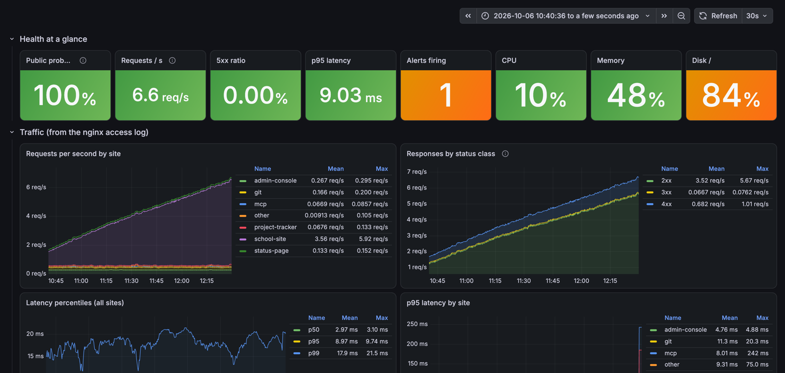

# infra-observability — راهنمای ساده

> نسخه‌ی انگلیسی: [README.md](README.md)

## این پروژه چیه؟

مانیتورینگ کامل یه سرور واقعی production که یه SaaS مدرسه‌ای چندمستأجری (multi-tenant)
روش اجرا می‌شه: سایت عمومی مدرسه، پنل ادمین، API، MongoDB، و کنارش Git،
project tracker و status page:

- **metric**: عددها، مثل CPU، رم، دیسک، تعداد request در ثانیه، زمان جواب
- **log**: خروجی همه‌ی containerها و همه‌ی requestهای nginx
- **dashboard**: نمودارهای Grafana
- **alert**: وقتی یه چیزی خراب شد خبر بده

کل این‌ها با **Terraform** ساخته می‌شه: از لپ‌تاپ یه دستور می‌زنی، Terraform
از طریق SSH به Docker سرور وصل می‌شه و همه‌ی containerها رو می‌سازه.

## چه شکلیه



screenshotهای بیشتر تو [README.md](README.md#screenshots) و پوشه‌ی `docs/screenshots/`.

## اول اصطلاح‌ها

| اصطلاح | یعنی چی |
|---|---|
| **Prometheus** | هر ۱۵ ثانیه از همه‌ی «exporter»ها عدد جمع می‌کنه و نگه می‌داره. قانون‌های alert رو هم اون چک می‌کنه |
| **exporter** | یه برنامه‌ی کوچیک که یه چیز رو به عدد تبدیل می‌کنه (مثلاً node-exporter وضعیت سرور رو) |
| **Grafana** | داشبورد. از Prometheus و Loki می‌خونه و نمودار می‌کشه |
| **Loki** | دیتابیس لاگ |
| **Alloy** | لاگ‌ها رو جمع می‌کنه و به Loki می‌فرسته |
| **Alertmanager** | alertهایی که Prometheus می‌سازه رو می‌گیره، تکراری‌ها رو حذف می‌کنه و می‌فرسته |
| **blackbox exporter** | مثل یه کاربر واقعی سایت رو باز می‌کنه و می‌گه بالاست یا نه، چقدر طول کشید |
| **k6** | ابزار تولید ترافیک. نقش کاربرهای الکی رو بازی می‌کنه |
| **Terraform** | زیرساخت رو به‌صورت کد تعریف می‌کنی. `plan` نشون می‌ده چی عوض می‌شه، `apply` انجامش می‌ده |
| **provider** | پلاگین Terraform برای یه سیستم خاص. اینجا `kreuzwerker/docker` |
| **state** | فایلی که Terraform توش یادش می‌مونه چی ساخته (`terraform.tfstate`) |
| **idempotent** | اگه دوباره `apply` بزنی و چیزی عوض نشده باشه، هیچ کاری نمی‌کنه |

## تصویر کلی

```
کاربر ─▶ CDN ─▶ nginx ─▶ سایت / پنل / API ─▶ MongoDB
                  │
                  │ هر request یه خط JSON تو access_json.log
                  ▼
                Alloy ─▶ Loki (لاگ)
                  │
                  └─▶ عدد: request در ثانیه، زمان جواب، کد وضعیت
                                │
node-exporter  (سرور) ─────────┤
cAdvisor       (containerها) ──┤
nginx-exporter                 ├──▶ Prometheus ──▶ Alertmanager ──▶ alert-logger ──▶ Loki
mongodb-exporter               │         │
blackbox (سایت از بیرون) ──────┤         └──▶ Grafana (داشبورد)
k6 (ترافیک مصنوعی) ────────────┘
```

## چه چیزهایی روی سرور ساخته شده

| container | کارش | پورت |
|---|---|---|
| prometheus | ذخیره‌ی metric، چک alert | `127.0.0.1:9090` |
| alertmanager | فرستادن alert | `127.0.0.1:9093` |
| grafana | داشبورد | `127.0.0.1:3005` |
| loki | ذخیره‌ی لاگ | `127.0.0.1:3100` |
| alloy | جمع‌کردن لاگ | داخلی |
| node-exporter | CPU، رم، دیسک سرور | `172.17.0.1:9100` (فقط از داخل) |
| cadvisor | مصرف هر container | داخلی |
| blackbox | چک سایت‌ها از بیرون | داخلی |
| nginx-exporter | اتصال‌های nginx | داخلی |
| mongodb-exporter | وضعیت MongoDB | داخلی |
| alert-logger | هر alert رو یه خط JSON چاپ می‌کنه | داخلی |
| loadgen-k6 | ترافیک مصنوعی ۹ ساعته | داخلی |

همه‌ی پورت‌ها یا روی `127.0.0.1` هستن یا داخلی؛ هیچی به اینترنت باز نیست.

## قدم به قدم

### ۱. ابزارها روی مک

```bash
brew tap hashicorp/tap
brew install hashicorp/tap/terraform
terraform version
```

### ۲. SSH بدون رمز به سرور

```bash
ssh -p 2222 root@SERVER_IP docker ps
```

اگه بدون پرسیدن رمز لیست containerها رو نشون داد، آماده‌ای.

### ۳. مشخصات سرور و سایت‌ها رو به Terraform بده

```bash
cp terraform/terraform.tfvars.example terraform/terraform.tfvars
```

همه‌ی چیزهایی که مال یه سرور خاصه تو این فایله و این فایل تو git نمی‌ره.
تو repo فقط template هست. فایل رو باز کن و این‌ها رو پر کن:

| متغیر | چیه |
|---|---|
| `ssh_host`، `ssh_user`، `ssh_port` | Terraform از کجا به Docker سرور وصل شه |
| `server_name` | یه اسم کوتاه برای سرور روی داشبورد |
| `sites` | سایت‌ها: Host، آدرس probe، و یه `name` کوتاه که به‌جای دامنه‌ی واقعی رو داشبورد نشون داده می‌شه |
| `api_probe` | (اختیاری) یه API که از nginx تا دیتابیس رو با هم چک می‌کنه |
| `app_containers` | containerهایی که همیشه باید روشن باشن |
| `app_network` | شبکه‌ی Docker برنامه، که exporter به MongoDB برسه |
| `loadgen` | دامنه‌ها و tenant برای ترافیک مصنوعی |

فایل‌هایی که پسوند `.tftpl` دارن template هستن. Terraform با `templatefile()`
از روی همین مقادیر پرشون می‌کنه. اگه بخوای خروجی رو ببینی: `make render`
(تو پوشه‌ی `build/`).

### ۴. nginx رو آماده کن (یه بار)

فایل `nginx/observability.conf` دو تا کار می‌کنه:
- یه لاگ دوم به فرمت JSON (لاگ قبلی دست نمی‌خوره)
- صفحه‌ی `stub_status` که فقط از داخل containerها در دسترسه

```bash
scp -P 2222 nginx/observability.conf root@SERVER_IP:/root/nginx/conf/conf.d/
scp -P 2222 nginx/logrotate-nginx-docker root@SERVER_IP:/etc/logrotate.d/nginx-docker
ssh -p 2222 root@SERVER_IP 'docker exec nginx nginx -t && docker exec nginx nginx -s reload'
```

`nginx -t` اول تست می‌کنه config سالمه؛ فقط اگه سالم بود reload می‌شه.

### ۵. بساز

```bash
make init     # provider رو دانلود می‌کنه
make plan     # نشون می‌ده چی ساخته می‌شه. هنوز هیچی عوض نمی‌شه
make apply    # می‌پرسه مطمئنی؟ بنویس yes
```

بعدش یه بار دیگه:

```bash
make plan
```

باید بگه **No changes**. یعنی کد و سرور دقیقاً یکی‌ان.

### ۶. Grafana رو باز کن

هیچی به اینترنت باز نیست، پس با SSH tunnel وصل می‌شی:

```bash
make tunnel        # این ترمینال رو باز نگه دار
```

یه ترمینال دیگه:

```bash
make password      # رمز admin گرافانا
```

حالا تو مرورگر:
- Grafana: <http://localhost:3005> (user: `admin`)
- Prometheus: <http://localhost:9090>
- Alertmanager: <http://localhost:9093>

صفحه‌ی اول Grafana داشبورد **Platform Overview**ـه.

### ۷. داشبورد Overview رو بخون

از بالا به پایین:

۱. **Health at a glance**: هشت تا عدد. سبز یعنی خوب، نارنجی یعنی حواست باشه، قرمز یعنی مشکل.
۲. **Traffic**: request در ثانیه برای هر سایت، کدهای وضعیت (2xx خوب، 4xx اشتباه کاربر، 5xx خرابی سرور)، و زمان جواب (p50، p95، p99).
۳. **Black-box probes**: سایت‌ها از دید یه کاربر واقعی از پشت CDN.
۴. **Containers**: مصرف CPU و رم هر container، خطوط لاگ خطا، restartها.
۵. **Synthetic traffic (k6)**: ترافیک مصنوعی.
۶. **MongoDB**: عملیات و اتصال‌ها.
۷. **Logs**: آخرین خطاها و آخرین alertها.

**p95 یعنی چی؟** اگه p95 = 0.2s، یعنی ۹۵٪ requestها زیر ۰.۲ ثانیه جواب گرفتن.
میانگین گول‌زننده‌ست؛ p95 نشون می‌ده کندترین کاربرها چی تجربه می‌کنن.

### ۸. لاگ‌ها رو بگرد

Grafana → **Explore** → بالا **Loki** رو انتخاب کن. چند تا query:

```
{container="nginx"}                                   لاگ یه container
{level="error"}                                       همه‌ی خطاها
{job="nginx", vhost="school-site", status_class="5"}  requestهای 5xx سایت مدرسه
{container="alert-logger"}                            همه‌ی alertهایی که فرستاده شده
```

### ۹. یه چیزی رو عوض کن

مثلاً تو `config/prometheus/rules/alerts.yml` آستانه‌ی CPU رو از 85 کن 80:

```bash
make plan     # می‌بینی فقط container prometheus عوض می‌شه
make apply
```

داده‌ها از دست نمی‌رن چون رو volume هستن.

## alertها

۲۲ تا قانون تو `config/prometheus/rules/alerts.yml`. مهم‌ترین‌ها:

| alert | کی fire می‌شه |
|---|---|
| `SiteDown` | یه سایت ۳ دقیقه از بیرون جواب نده |
| `AppApiDown` | API برنامه جواب درست نده (یعنی nginx یا backend یا دیتابیس خرابه) |
| `High5xxRate` | بیشتر از ۵٪ requestهای یه سایت 5xx بشن |
| `HighLatencyP95` | p95 یه سایت ۱۰ دقیقه بالای ۱.۵ ثانیه بمونه |
| `AppContainerMissing` | یکی از containerهای اصلی برنامه (`app_containers`) نباشه |
| `ContainerRestarting` | یه container restart بشه |
| `HostDiskAlmostFull` | دیسک بالای ۹۰٪ |
| `HostDiskWillFillIn24h` | با این سرعت، دیسک تا ۲۴ ساعت دیگه پر می‌شه |
| `MongoDown` | MongoDB جواب نده |
| `ErrorLogBurst` | یه container بیشتر از ۳۰ خط خطا در دقیقه بنویسه |
| `TlsCertExpiresSoon` | گواهی کمتر از ۱۴ روز اعتبار داره |

**الان alertها کجا می‌رن؟** به `alert-logger`، که هر alert رو یه خط JSON چاپ
می‌کنه و Alloy می‌فرسته به Loki. برای Telegram یا ایمیل: [docs/ALERTS.md](docs/ALERTS.md).

**تست دستی کل مسیر:**

```bash
curl -XPOST localhost:9093/api/v2/alerts -H 'Content-Type: application/json' \
  -d '[{"labels":{"alertname":"PipelineTest","severity":"info"}}]'
```

بعد تو Grafana: `{container="alert-logger"}`.

## ترافیک مصنوعی (k6)

`loadgen/scenarios.js` نقش این کاربرها رو بازی می‌کنه:

| سناریو | چیکار می‌کنه |
|---|---|
| `website_visitors` | صفحه‌ی اصلی، API سایت، یه پست یا صفحه |
| `admin_logins` | صفحه‌ی لاگین، `auth/me` بدون توکن (باید 401 بده)، لاگین با رمز غلط (باید 4xx بده، نه 5xx) |
| `console_users` | پنل console |
| `bots` | مسیرهایی که نباید وجود داشته باشن (`/.env`، `/wp-login.php`) |
| `git_readers` | صفحه‌های عمومی Gitea |
| `spike` | ۱۰ دقیقه، وسط اجرا، ۵ بازدید در ثانیه (مثل یه کلاس که همزمان سایت رو باز می‌کنه) |

بار کم نگه داشته شده (حداکثر حدود ۱۲ request در ثانیه). شکل ترافیک مثل یه روز
عادیه: آروم، شلوغ، یه spike، دوباره آروم. ۹ ساعت اجرا می‌شه و خودش تموم می‌شه.

دوباره اجرا: `make loadgen-restart`.

## اندازه

روی این سرور (۴ هسته، ۸ گیگ رم) کل stack حدود ۱ گیگ رم می‌گیره. هر
container سقف رم داره و swap نداره، پس اگه یکی از کنترل خارج شد، فقط خودش
restart می‌شه، کل سرور کند نمی‌شه. Prometheus ۱۵ روز یا ۳ گیگ داده نگه می‌داره
(هر کدوم زودتر برسه)، Loki ۷ روز.

## برای مصاحبه

این پروژه رو اینطوری تعریف کن:

> «یه سرور واقعی داشتیم که مانیتورینگ نداشت. با Terraform و provider داکر، از
> طریق SSH یه stack کامل Prometheus، Alertmanager، Grafana، Loki و Alloy روش
> ساختم. لاگ nginx رو JSON کردم که Alloy ازش metric درخواست و latency برای هر
> سایت دربیاره. با blackbox سایت‌ها رو از پشت CDN مثل کاربر واقعی چک می‌کنم.
> ۲۲ تا alert دارم. با k6 یه شب کامل ترافیک واقعی‌نما زدم.»

سؤال‌هایی که احتمالاً می‌پرسن و جوابش:

- **چرا Terraform و نه docker compose؟** state و `plan` داری: قبل از هر تغییر می‌بینی دقیقاً چی عوض می‌شه، و `plan` بعد از `apply` باید «No changes» بگه. config فایل‌ها با `upload` داخل container می‌رن، پس روی سرور فایل دستی‌ای نیست که drift کنه.
- **چه مشکلی پیش اومد؟** بعد از اولین apply، load سرور رفت ۱۲. cAdvisor به سقف رمش خورده بود و چون swap داشت، kernel به‌جای kill کردن swapش می‌کرد و disk I/O صددرصد شد. راه‌حل: `memory_swap = memory` روی همه‌ی containerها و خاموش کردن metric `disk` در cAdvisor. جزئیات: [docs/TROUBLESHOOTING.md](docs/TROUBLESHOOTING.md).
- **چرا metric از لاگ nginx؟** nginx نسخه‌ی رایگان metric هر سایت و latency نمی‌ده. با لاگ JSON، Alloy برای هر سایت شمارنده و histogram می‌سازه.
- **چرا blackbox از پشت CDN؟** چون کاربر از اونجا میاد. اگه CDN خراب باشه، چک داخلی سبز نشون می‌ده ولی کاربر قطعه.

**یه خط برای رزومه:**
> Deployed a full observability stack (Prometheus, Alertmanager, Grafana, Loki, Alloy, blackbox/node/cAdvisor/nginx/MongoDB exporters) to a production Docker host with Terraform over SSH; derived per-vhost RED metrics from nginx JSON logs, wrote 22 alert rules, provisioned dashboards as code, and validated the pipeline with an overnight k6 synthetic-traffic run.
